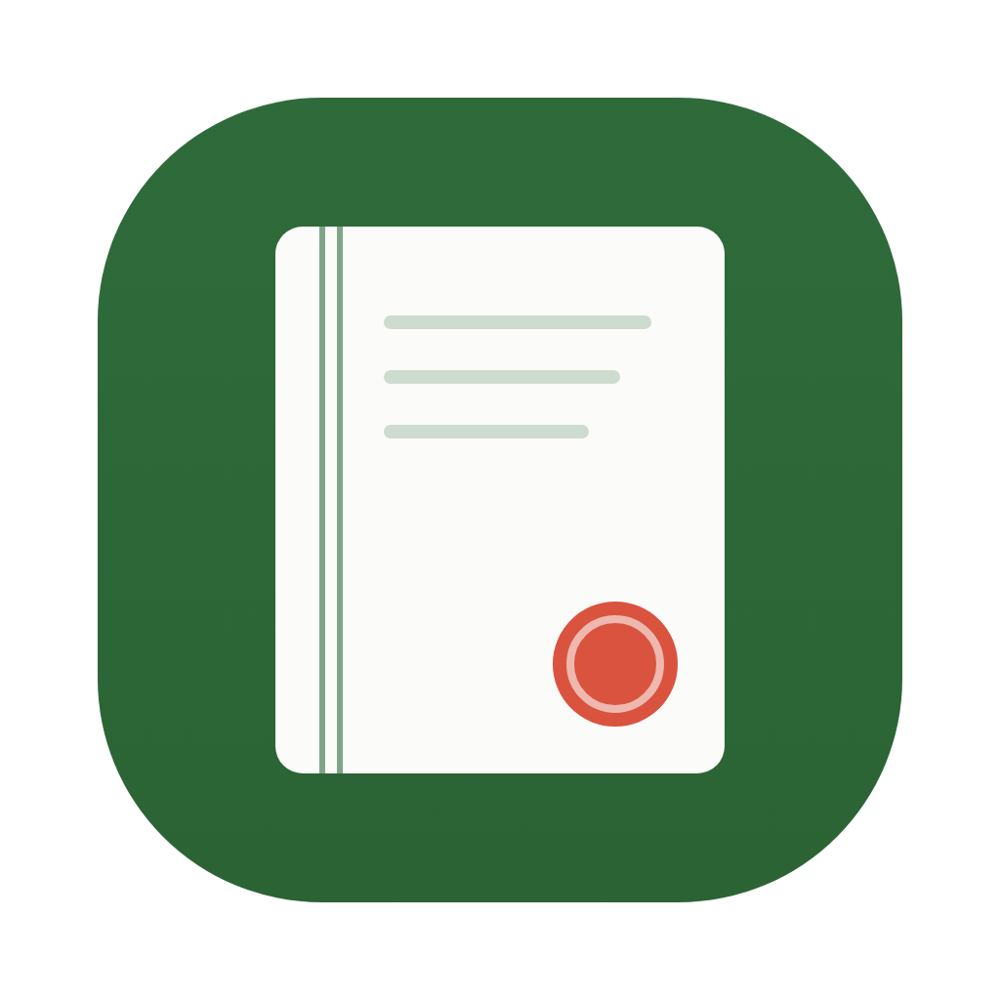

<div align="center">



# KNUAF-Dev · 창업논문 작성 도우미

**한국농수산대학교 창업논문·영농계획서를 학교 공식 작성지침에 맞춰 쓰고 검토하는 도구입니다.**

AI 도우미가 질문을 던지며 함께 쓰고, 앱은 그동안 무엇이 확인됐고 무엇이 안 됐는지를 보여줍니다.

[**설치본 내려받기**](../../releases/latest) · [사용 안내](docs/학생용-사용안내.md) · [설치가 막힐 때 (macOS)](docs/설치-안내-macOS.md)

</div>

> [!WARNING]
> **초기 베타입니다.** 아직 실사용 검증이 충분하지 않습니다. 실제 제출용 논문에 쓰시기 전에 **원본 답변·자료를 따로 백업**해 두세요. 서명이 없어 macOS 가 처음 한 번 실행을 막습니다.

---

## 이 도구가 하는 일

- 학교 공식 PDF 지침과 내가 쓴 원답변을 **근거로 삼아** 창업논문 Ⅰ~Ⅵ장을 씁니다.
- **사실·목표·가정·계산을 구분해서** 관리합니다. 원문 근거가 없는 주장은 자동으로 통과시키지 않습니다.
- 재무계획 엑셀(XLSX)과 논문 워드(DOCX)를 만들고, 학교 원문에서 분해한 지침 항목과 대조합니다.
- 잔류 잠금 해제·정본 스냅샷 복원 같은 사고 수습도 버튼으로 됩니다.

## 이 도구가 하지 않는 일

이게 더 중요합니다.

- **지도교수 승인을 대신하지 않습니다.** 앱은 승인 여부를 판정하지 않고, 기록만 보여줍니다.
- **자동 점검 통과를 "완료"로 바꾸지 않습니다.** 확인은 네 갈래(자동 점검 / 다른 사람 검토 / 파일 확인 / 교수님 승인)로 **끝까지 따로** 표시됩니다. 하나의 체크표시로 합치지 않습니다.
- **모르는 것을 안다고 하지 않습니다.** 확인 못 한 항목은 "보류"로 남고, 통과로 세지 않습니다.
- **아무것도 기기 밖으로 보내지 않습니다.** 앱 안에는 AI가 없습니다. 논문을 쓰는 건 사용자가 직접 로그인한 AI 도우미(Claude Code 또는 ChatGPT)이고, 그 대화만 해당 서비스로 갑니다.

최종 책임은 항상 작성자 본인에게 있습니다.

## 화면

도우미와 대화하며 논문을 씁니다. 앱은 진행 상황을 옆에서 보여줍니다.


확인 상태는 네 갈래로 따로 섭니다. 아래는 아직 아무것도 끝나지 않은 상태입니다.


만든 파일은 결과물 화면에 모입니다.


## 학생이라면 — 설치

1. [릴리스 페이지](../../releases/latest)에서 `.dmg` 를 받습니다.
2. 열어서 앱을 **응용 프로그램** 폴더로 끌어다 놓습니다.
3. 처음 열 때 "확인되지 않은 개발자" 경고가 나오면 [설치 안내 (macOS)](docs/설치-안내-macOS.md)를 따라 주세요.

> 아직 Apple 개발자 서명이 없어 macOS가 한 번 막습니다. 한 번만 허용하면 그다음부터는 그냥 열립니다.

Python·라이브러리 설치는 앱이 알아서 합니다. 따로 준비할 것은 없습니다.

## 에이전트 스킬로만 쓰려면

앱 없이 Codex CLI나 Claude Code에 스킬로 붙여 쓸 수도 있습니다. **Python 3.10 이상이 필요합니다** — macOS 기본 `python3`(3.9)로는 첫 명령에서 안내와 함께 종료됩니다.

- **Claude Code**: 이 저장소를 플러그인 마켓플레이스로 추가하거나, `skills/knuaf-doc` 을 `~/.claude/skills/knuaf-doc` 로 복사합니다.
- **Codex**: 저장소를 플러그인으로 등록하면 `.codex-plugin/plugin.json` 이 같은 스킬을 노출합니다.

실행 의존성은 `skills/knuaf-doc/scripts/requirements-runtime.txt` 에 있습니다 (`openpyxl`, `python-docx`, `pypdf`). Windows에서 네이티브 Office 자동화를 쓰려면 `pywin32` 가 추가로 필요합니다.

## 플랫폼

핵심 로직(사실 관리·지침 검사·DOCX/XLSX 생성)은 순수 Python이고 macOS·Linux에서 검증했습니다. 잠금과 가져오기의 Windows 경로는 이식을 마쳤고 해당 분기를 강제로 켜는 테스트가 모든 OS에서 돕니다.

마지막 단계인 "네이티브 Office로 실제 재계산·페이지 렌더까지 확인"만 플랫폼을 탑니다.

| 플랫폼 | 구현 | 실사용 검증 |
|---|---|---|
| macOS | AppleScript(osascript) | 완료 — 실제 Word/Excel로 반복 검증 |
| Windows | COM 자동화(pywin32) | **아직 없음.** 코드와 정적 검사만 있습니다 |

Windows에서 써보시고 문제를 만나면 이슈로 알려주세요.

## 개발

```bash
python3.13 -m venv .venv-dev
.venv-dev/bin/pip install pytest pytest-timeout -r skills/knuaf-doc/scripts/requirements-runtime.txt
.venv-dev/bin/python -m pytest
```

앱은 [app/README.md](app/README.md) 를 보세요. CI는 ubuntu/macos/windows × Python 3.10/3.13 에서 같은 테스트를 돌립니다.

## 학교 공식 지침 원문

저작권이 불확실한 학교 공식 PDF·발췌본은 이 저장소에 **들어 있지 않습니다.** 사용자가 자신의 학교 공식 원문을 직접 준비해서 등록해야 합니다.

## 라이선스

MIT — [LICENSE](LICENSE). 원본 스킬은 [starceas/knuaf-doc](https://github.com/starceas/knuaf-doc) 입니다.
