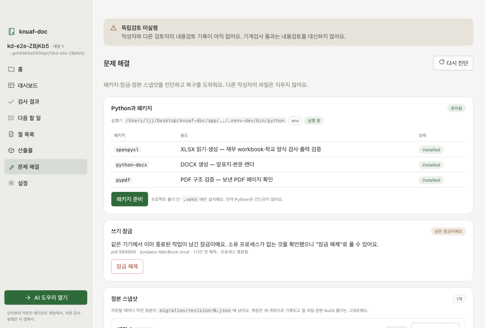
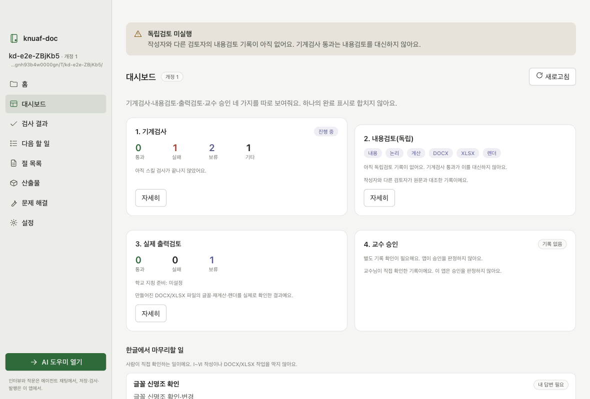
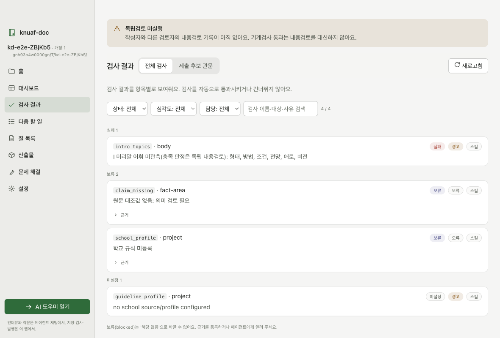
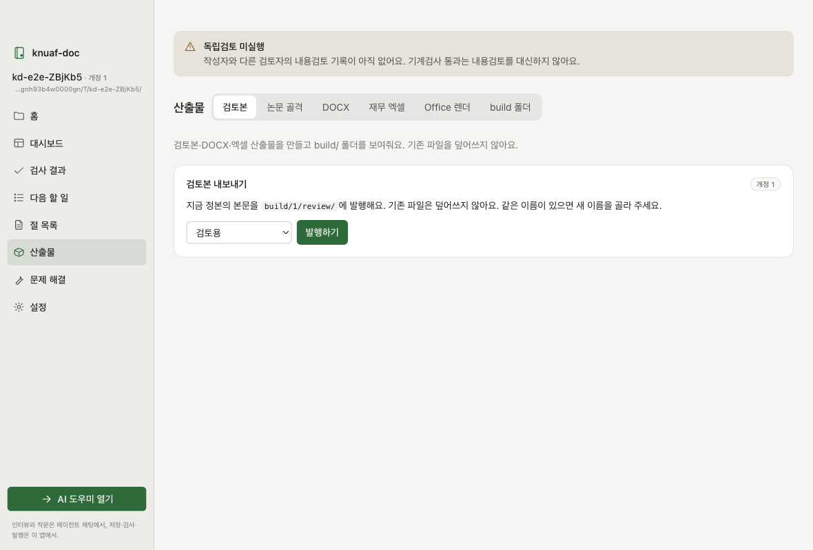

# knuaf-doc 동반 앱 사용 안내 (학생용)

논문은 AI 도우미가 채팅으로 인터뷰하며 써요. 이 앱은 그 옆에서 저장 상태와 검사 결과를 보여 주고, 버튼으로 산출물을 만들어요.

## 1. 이 툴은 무엇인가요

먼저 이것만은 꼭 알아 두세요.

- **논문을 쓰는 건 AI 도우미(Claude Code)예요.** 도우미가 채팅으로 질문하고, 답을 들으며 논문을 써요. 인터뷰 답변도 채팅에서 해요.
- **이 앱은 논문을 쓰지 않아요.** 도우미가 저장한 내용을 읽어서 저장 상태, 검사 결과, 다음 할 일, 만들어진 파일을 보여 줘요. 검사와 발행, 복구는 버튼으로 실행해요.
- **그래서 창을 두 개 같이 써요.** 이 앱 창 하나, AI 도우미 창 하나예요. 앱 안에서 전부 되는 게 아니에요.
- 명령어나 JSON은 몰라도 돼요.

<svg xmlns="http://www.w3.org/2000/svg" width="720" height="250" viewBox="0 0 720 250" font-family="-apple-system, 'Apple SD Gothic Neo', Pretendard, sans-serif" font-size="13" role="img" aria-label="학생, AI 도우미, 논문 폴더, 이 앱의 관계">
  <defs>
    <marker id="arr" viewBox="0 0 10 10" refX="9" refY="5" markerWidth="8" markerHeight="8" orient="auto-start-reverse">
      <path d="M0,0 L10,5 L0,10 z" fill="#444" />
    </marker>
    <marker id="arrg" viewBox="0 0 10 10" refX="9" refY="5" markerWidth="8" markerHeight="8" orient="auto-start-reverse">
      <path d="M0,0 L10,5 L0,10 z" fill="#2f6b3a" />
    </marker>
  </defs>
  <!-- 학생 -->
  <rect x="20" y="70" width="110" height="70" rx="8" fill="#fff" stroke="#444" stroke-width="1.5" />
  <text x="75" y="110" text-anchor="middle" font-size="15" font-weight="600" fill="#222">학생</text>
  <!-- AI 도우미 -->
  <rect x="200" y="50" width="220" height="110" rx="8" fill="#fff" stroke="#444" stroke-width="1.5" />
  <text x="310" y="80" text-anchor="middle" font-size="15" font-weight="600" fill="#222">AI 도우미 (Claude Code)</text>
  <text x="310" y="104" text-anchor="middle" fill="#444">채팅으로 인터뷰</text>
  <text x="310" y="124" text-anchor="middle" fill="#444">논문 작문 · 저장 요청</text>
  <text x="310" y="146" text-anchor="middle" font-size="11" fill="#777">터미널 창</text>
  <!-- 학생 <-> 도우미 -->
  <line x1="134" y1="105" x2="196" y2="105" stroke="#444" stroke-width="1.5" marker-start="url(#arr)" marker-end="url(#arr)" />
  <text x="165" y="94" text-anchor="middle" font-size="11" fill="#666">질문 · 답변</text>
  <!-- 논문 폴더 -->
  <rect x="490" y="50" width="210" height="110" rx="8" fill="#f4f8f5" stroke="#2f6b3a" stroke-width="1.5" />
  <text x="595" y="80" text-anchor="middle" font-size="15" font-weight="600" fill="#2f6b3a">논문 폴더</text>
  <text x="595" y="104" text-anchor="middle" fill="#444">정본 · 절 파일</text>
  <text x="595" y="124" text-anchor="middle" fill="#444">산출물(DOCX · 엑셀)</text>
  <text x="595" y="146" text-anchor="middle" font-size="11" fill="#777">내 Mac 안</text>
  <!-- 도우미 -> 폴더 -->
  <line x1="424" y1="105" x2="486" y2="105" stroke="#2f6b3a" stroke-width="1.5" marker-end="url(#arrg)" />
  <text x="455" y="94" text-anchor="middle" font-size="11" fill="#2f6b3a">저장</text>
  <!-- 이 앱 -->
  <rect x="490" y="185" width="210" height="52" rx="8" fill="#fff" stroke="#444" stroke-width="1.5" />
  <text x="595" y="207" text-anchor="middle" font-size="15" font-weight="600" fill="#222">이 앱 (동반 앱)</text>
  <text x="595" y="226" text-anchor="middle" font-size="12" fill="#444">상태 · 검사 · 발행 · 복구</text>
  <!-- 앱 -> 폴더 -->
  <line x1="595" y1="181" x2="595" y2="164" stroke="#2f6b3a" stroke-width="1.5" marker-end="url(#arrg)" />
  <text x="608" y="177" font-size="11" fill="#2f6b3a">읽기 · 검사</text>
  <!-- 학생 -> 앱 -->
  <path d="M75,144 L75,211 L486,211" fill="none" stroke="#444" stroke-width="1.5" marker-end="url(#arr)" />
  <text x="280" y="203" text-anchor="middle" font-size="11" fill="#666">버튼으로 실행 · 결과 확인</text>
</svg>

## 2. 준비물

- **Mac** — 이 앱은 macOS용이에요.
- **Microsoft Word, Excel** (선택) — 최종 문서를 실제로 열어 보고 렌더할 때 써요. 없어도 논문 쓰기는 돼요.
- **Claude 계정** — Pro, Max 같은 **유료 요금제**가 필요해요. 무료 계정으로는 Claude Code를 쓸 수 없어요.
- **Claude Code 설치** — 앱이 없으면 앱이 설치 안내를 띄워요. https://claude.ai/code 에서 설치하거나, 터미널에서 `curl -fsSL https://claude.ai/install.sh | bash` 한 줄을 실행해요.

## 3. 설치

1. `knuaf-doc Companion-….dmg`를 열어요.
2. 앱을 **응용 프로그램** 폴더로 끌어다 놓아요.

## 4. 처음 실행

앱은 아직 Apple 서명이 없어서 처음에는 "열 수 없음"이라고 나올 수 있어요.

- **macOS 14 이하**: 응용 프로그램에서 앱을 **오른쪽 클릭 → 열기 → 열기**.
- **macOS 15 이상**: 한 번 실행을 시도한 뒤 **시스템 설정 → 개인정보 보호 및 보안** 맨 아래에서 **그래도 열기**.

두 번째부터는 그냥 실행하면 돼요.

## 5. 폴더 열기

홈에서 **폴더 열기…** 를 누르고 논문 작업 폴더를 골라요. 새 빈 폴더도 괜찮고, 이미 쓰던 폴더도 괜찮아요.
최근에 연 폴더는 홈에 카드로 남아요.

## 6. 패키지 준비 (한 번만)

**문제 해결** 화면에서 **패키지 준비**를 눌러요. 검사와 발행에 필요한 Python 패키지를 논문 폴더 안 `.venv`에만 설치해요.
컴퓨터의 다른 Python은 건드리지 않아요. 인터넷이 없어도 앱 안에 들어 있는 패키지로 설치돼요.

## 7. AI 도우미 열기

홈에서 **AI 도우미 열기** 버튼을 눌러요. 그러면 앱이 이렇게 해요.

1. 규칙집을 도우미가 읽는 자리(내 계정의 Claude 설정 폴더)에 자동으로 설치해요. 도우미가 논문을 어떤 순서와 형식으로 쓸지 적힌 파일이에요. 내 자료는 옮기지 않아요.
2. 터미널 창을 열고 AI 도우미를 켜요.
3. **"시작하기"** 를 대신 입력해요. 인터뷰가 바로 시작돼요.

처음이면 브라우저에 Claude 로그인 창이 떠요. 로그인하면 돼요.

이후 답변은 모두 **그 터미널 창**에서 해요. 이 앱은 답을 받지 않아요. 그래야 인터뷰 기록이 채팅에 그대로 남아요.
도우미가 저장할 때마다 이 앱의 대시보드와 검사 결과가 새로 바뀌어요.

## 8. 화면 안내

| 화면 | 보여 주는 것 |
|---|---|
| 홈 | 폴더 열기, 최근 폴더, AI 도우미 열기, 시작 단계 |
| 대시보드 | 기계검사 · 내용검토 · 실제 출력검토 · 교수 승인, 네 가지를 따로. 한글에서 마무리할 일 |
| 검사 결과 | 검사 하나하나의 통과/실패/보류와 사유 |
| 다음 할 일 | 내 답변이 필요한 일, 근거가 필요한 일, 진행 가능한 일 |
| 절 목록 | 등록된 절과 본문 미리보기(읽기 전용) |
| 산출물 | 검토본 내보내기, 논문 골격, DOCX, 재무 엑셀, Office 렌더, build 폴더 |
| 문제 해결 | 패키지, 잠금, 정본 스냅샷, 남은 임시 파일, 문서 읽기 도구 |
| 설정 | Python 실행기(고급), 최근 폴더 지우기, 로그 |

**독립검토 미실행** 띠가 맨 위에 보이면, 아직 작성자와 다른 사람이 내용을 검토한 기록이 없다는 뜻이에요. 기계검사 통과와는 별개예요.

## 9. 막혔을 때

- **"다른 작업이 이 폴더를 잠그고 있어요"** — 도우미가 저장 중이면 잠깐 기다려요. 아무것도 안 돌고 있는데 계속 그러면 **문제 해결 → 쓰기 잠금**에서 상태를 보고, "남은 잠금"이면 **잠금 해제**를 눌러요. 다른 컴퓨터의 잠금이거나 아직 살아 있는 작업의 잠금은 앱이 풀지 않아요.
- **정본이 꼬였을 때** — **문제 해결 → 정본 스냅샷**에서 이전 개정으로 복원할 수 있어요. 복원 전에 지금 상태를 먼저 저장해 두니 되돌릴 수 있어요. 절 파일과 만들어진 문서는 그대로예요.
- **"필요한 패키지가 아직 준비되지 않았어요"** — 6번의 패키지 준비를 해요.
- **도우미 창을 닫아 버렸을 때** — 홈에서 **AI 도우미 열기**를 다시 눌러요. 이전 대화를 이어갈 수 있어요.
- 오류 메시지의 **자세히**를 열어 그 내용을 도우미에게 붙여 넣으면 대부분 해결돼요.

## 10. 이 앱이 절대 하지 않는 것

- 인터뷰 답변을 받지 않아요. (도우미 창에서만)
- 논문 본문을 편집하지 않아요. (읽기 전용 미리보기만)
- 만든 파일을 덮어쓰지 않아요. 같은 이름이 있으면 새 이름을 제안해요.
- 다른 사람의 파일을 지우지 않아요.
- 교수 승인을 판정하지 않아요.
- 아무것도 컴퓨터 밖으로 보내지 않아요.

## 11. 자주 묻는 질문

**앱만으로 논문이 되나요?**
아니요. 논문은 AI 도우미가 채팅으로 인터뷰하며 써요. 이 앱은 그 결과를 보여 주고 검사와 발행을 도와요. 두 창을 같이 써야 해요.

**인터넷이 필요한가요?**
AI 도우미는 필요해요. 앱 자체는 인터넷 없이도 돼요. 검사, 산출물 만들기, 복구는 모두 내 Mac 안에서 돌아가요.

**내 자료가 어디로 가나요?**
이 앱은 아무것도 밖으로 보내지 않아요. AI 도우미는 대화 내용을 Anthropic 서비스에 보내요. 인터뷰에서 말한 내용과 도우미가 읽은 파일이 여기에 들어가요.
