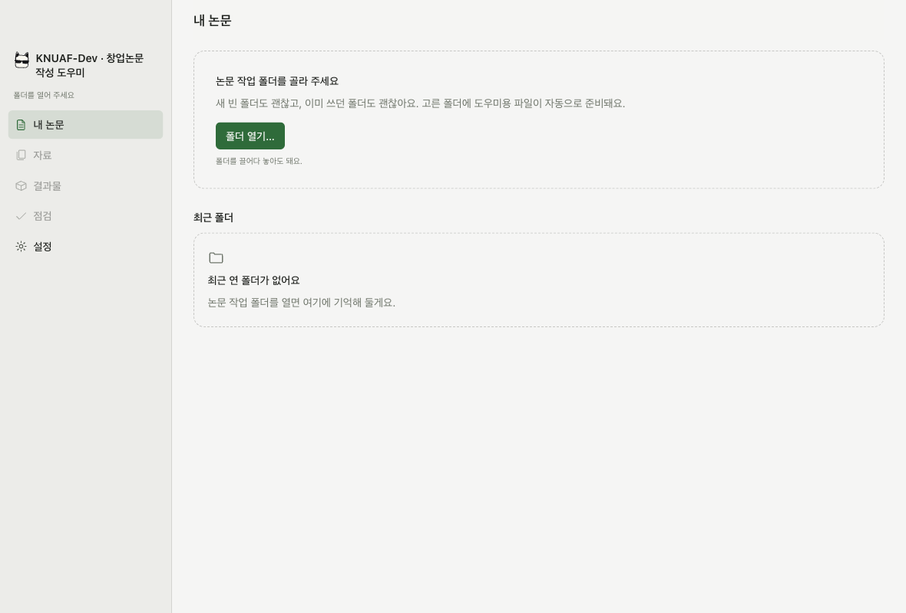
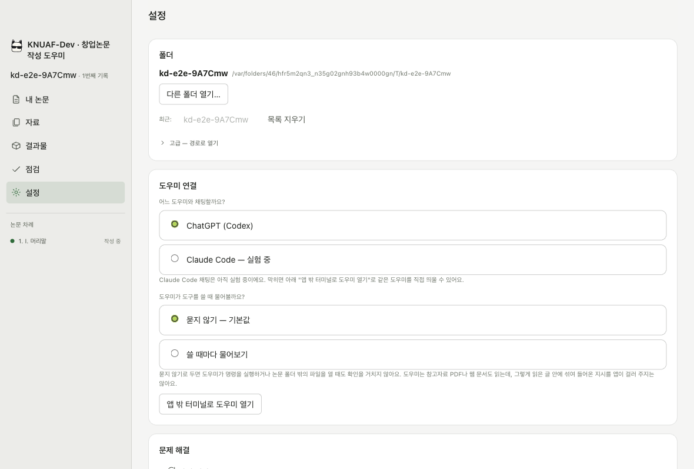
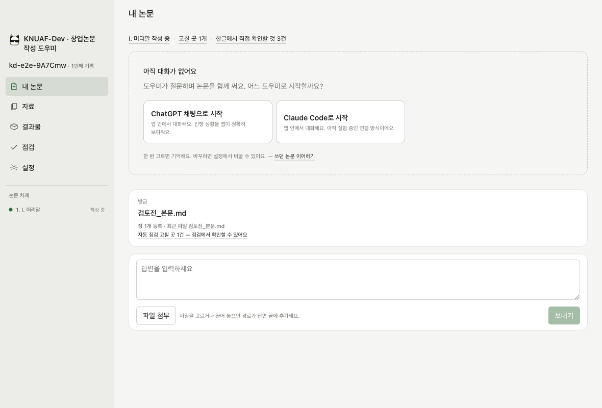
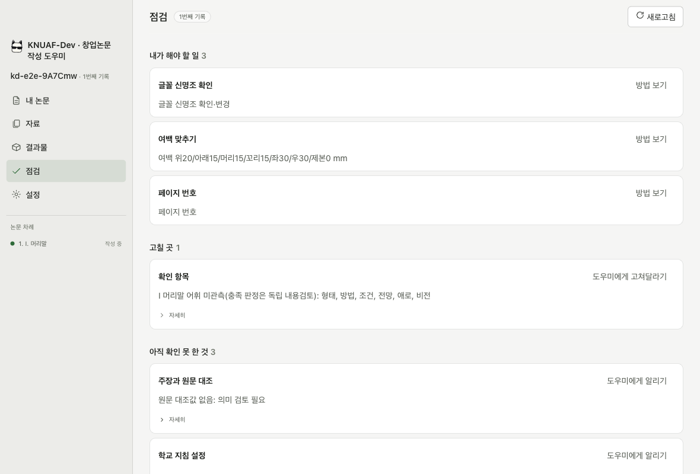
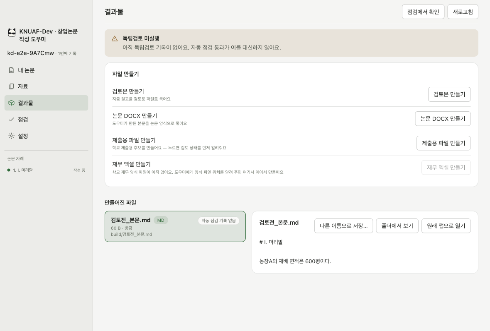
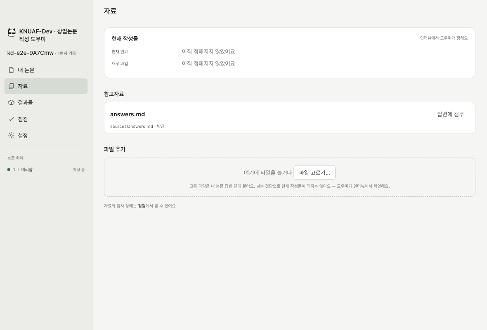
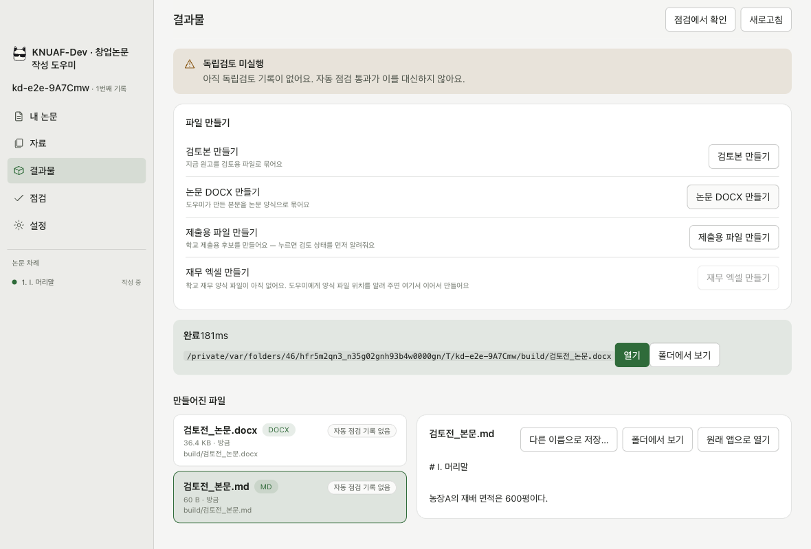

# KNUAF-Dev · 창업논문 작성 도우미 사용 안내 (학생용)

논문은 AI 도우미가 채팅으로 인터뷰하며 써요. 이 앱은 그 옆에서 저장 상태와 점검 결과를 보여 주고, 버튼으로 결과물을 만들어요.

## 1. 이 툴은 무엇인가요

먼저 이것만은 꼭 알아 두세요.

- **논문을 쓰는 건 AI 도우미(Codex 또는 Claude Code)예요.** 도우미가 채팅으로 질문하고, 답을 들으며 논문을 써요. 인터뷰 답변도 채팅에서 해요.
- **이 앱은 논문을 쓰지 않아요.** 도우미가 저장한 내용을 읽어서 저장 상태, 점검 결과, 만들어진 파일을 보여 줘요. 자동 점검과 파일 만들기, 복구는 버튼으로 실행해요.
- **AI 도우미는 이 앱 안에서 열어요.** "내 논문" 화면에서 채팅(Codex)이나 앱 안 터미널(Claude)로 도우미와 대화해요.
- 명령어나 JSON은 몰라도 돼요.

<svg xmlns="http://www.w3.org/2000/svg" width="720" height="250" viewBox="0 0 720 250" font-family="-apple-system, 'Apple SD Gothic Neo', Pretendard, sans-serif" font-size="13" role="img" aria-label="학생, AI 도우미, 논문 폴더, 이 앱의 관계">
  <defs>
    <marker id="arr" viewBox="0 0 10 10" refX="9" refY="5" markerWidth="8" markerHeight="8" orient="auto-start-reverse">
      <path d="M0,0 L10,5 L0,10 z" fill="#444" />
    </marker>
    <marker id="arrg" viewBox="0 0 10 10" refX="9" refY="5" markerWidth="8" markerHeight="8" orient="auto-start-reverse">
      <path d="M0,0 L10,5 L0,10 z" fill="#2f6b3a" />
    </marker>
  </defs>
  <!-- 학생 -->
  <rect x="20" y="70" width="110" height="70" rx="8" fill="#fff" stroke="#444" stroke-width="1.5" />
  <text x="75" y="110" text-anchor="middle" font-size="15" font-weight="600" fill="#222">학생</text>
  <!-- AI 도우미 -->
  <rect x="200" y="50" width="220" height="110" rx="8" fill="#fff" stroke="#444" stroke-width="1.5" />
  <text x="310" y="80" text-anchor="middle" font-size="15" font-weight="600" fill="#222">AI 도우미 (Codex · Claude)</text>
  <text x="310" y="104" text-anchor="middle" fill="#444">채팅으로 인터뷰</text>
  <text x="310" y="124" text-anchor="middle" fill="#444">논문 작문 · 저장 요청</text>
  <text x="310" y="146" text-anchor="middle" font-size="11" fill="#777">앱 안 채팅 · 터미널</text>
  <!-- 학생 <-> 도우미 -->
  <line x1="134" y1="105" x2="196" y2="105" stroke="#444" stroke-width="1.5" marker-start="url(#arr)" marker-end="url(#arr)" />
  <text x="165" y="94" text-anchor="middle" font-size="11" fill="#666">질문 · 답변</text>
  <!-- 논문 폴더 -->
  <rect x="490" y="50" width="210" height="110" rx="8" fill="#f4f8f5" stroke="#2f6b3a" stroke-width="1.5" />
  <text x="595" y="80" text-anchor="middle" font-size="15" font-weight="600" fill="#2f6b3a">논문 폴더</text>
  <text x="595" y="104" text-anchor="middle" fill="#444">논문 데이터 · 장 파일</text>
  <text x="595" y="124" text-anchor="middle" fill="#444">결과물(DOCX · 엑셀)</text>
  <text x="595" y="146" text-anchor="middle" font-size="11" fill="#777">내 Mac 안</text>
  <!-- 도우미 -> 폴더 -->
  <line x1="424" y1="105" x2="486" y2="105" stroke="#2f6b3a" stroke-width="1.5" marker-end="url(#arrg)" />
  <text x="455" y="94" text-anchor="middle" font-size="11" fill="#2f6b3a">저장</text>
  <!-- 이 앱 -->
  <rect x="490" y="185" width="210" height="52" rx="8" fill="#fff" stroke="#444" stroke-width="1.5" />
  <text x="595" y="207" text-anchor="middle" font-size="15" font-weight="600" fill="#222">이 앱</text>
  <text x="595" y="226" text-anchor="middle" font-size="12" fill="#444">상태 · 점검 · 만들기 · 복구</text>
  <!-- 앱 -> 폴더 -->
  <line x1="595" y1="181" x2="595" y2="164" stroke="#2f6b3a" stroke-width="1.5" marker-end="url(#arrg)" />
  <text x="608" y="177" font-size="11" fill="#2f6b3a">읽기 · 점검</text>
  <!-- 학생 -> 앱 -->
  <path d="M75,144 L75,211 L486,211" fill="none" stroke="#444" stroke-width="1.5" marker-end="url(#arr)" />
  <text x="280" y="203" text-anchor="middle" font-size="11" fill="#666">버튼으로 실행 · 결과 확인</text>
</svg>

## 2. 준비물

- **Mac** — 이 앱은 macOS용이에요.
- **Microsoft Word, Excel** (선택) — 최종 문서를 실제로 열어 보고 렌더할 때 써요. 없어도 논문 쓰기는 돼요.
- **ChatGPT 계정 또는 Claude 계정** — Codex 채팅은 ChatGPT 로그인으로 써요. Claude 터미널은 Pro, Max 같은 **유료 요금제** Claude 계정이 필요해요. 둘 중 하나만 있어도 시작할 수 있어요.
- **Codex 또는 Claude Code 설치** — 없으면 앱이 설치 안내를 띄워요. Codex는 터미널에서 `npm i -g @openai/codex`, Claude Code는 `curl -fsSL https://claude.ai/install.sh | bash` 한 줄로 설치할 수 있어요.

## 3. 설치

1. `KNUAF Thesis Helper-….dmg`를 열어요.
2. 앱을 **응용 프로그램** 폴더로 끌어다 놓아요.

## 4. 처음 실행

앱은 아직 Apple 서명이 없어서 처음에는 "열 수 없음"이라고 나올 수 있어요.

- **macOS 14 이하**: 응용 프로그램에서 앱을 **오른쪽 클릭 → 열기 → 열기**.
- **macOS 15 이상**: 한 번 실행을 시도한 뒤 **시스템 설정 → 개인정보 보호 및 보안** 맨 아래에서 **그래도 열기**.

두 번째부터는 그냥 실행하면 돼요.

## 5. 폴더 열기

앱을 열면 **내 논문** 화면에서 **폴더 열기…** 를 눌러 논문 작업 폴더를 골라요. 새 빈 폴더도 괜찮고, 이미 쓰던 폴더도 괜찮아요.
최근에 연 폴더는 같은 화면 아래에 카드로 남아요.

## 6. 작업 준비 (자동)

폴더를 열면 점검과 파일 만들기에 필요한 도구를 논문 폴더 안 `.venv`에 자동으로 준비해요.
준비가 안 되면 화면에 알림이 뜨고, **설정 → 문제 해결 → 준비 상태 → 패키지 준비**에서 다시 시도할 수 있어요.
컴퓨터의 다른 Python은 건드리지 않아요. 인터넷이 없어도 앱 안에 들어 있는 파일로 설치돼요.

## 7. 내 논문 화면에서 인터뷰하기

**내 논문** 화면이 인터뷰와 작문이 일어나는 곳이에요. 앱이 규칙집을 논문 폴더 안의 도우미 설정 폴더에 자동으로 넣어 둬요. 도우미가 논문을 어떤 순서와 형식으로 쓸지 적힌 파일이에요. 내 자료는 옮기지 않아요.

대화가 비어 있으면 시작 버튼이 보여요 — "시작하기"를 직접 칠 필요는 없어요. 두 도우미가 다 설치돼 있으면 처음 한 번 골라요.

- **ChatGPT 채팅으로 시작** — 앱 안 채팅이에요. 처음이면 **ChatGPT 로그인**을 눌러 브라우저에서 로그인해요. 이후 도우미의 질문에 채팅으로 답해요. Enter는 전송, Shift+Enter는 줄바꿈이에요.
- **Claude Code 터미널로 시작** — 앱 창 안에 진짜 Claude Code 터미널이 열려요. 처음이면 그 터미널 안에서 Claude 로그인을 해요. 도우미가 꺼져 있으면 **다시 시작**으로 새로 열고, 이전 대화는 **이어서 하기**로 돌아와요. 진행 상태를 앱이 정확히 알 수 없어요.

한 번 고르면 기억해요. 바꾸려면 설정에서 바꿀 수 있어요.

알아 두면 좋은 것:

- 답변이 **전송 여부 불확실**로 표시되면 내용을 확인한 뒤 **다시 보내기**를 눌러요. 앱은 답변이 도우미에게 닿았는지 스스로 판단하지 않아요.
- 도우미가 답변을 만들거나 터미널이 막 출력을 낸 동안에는 저장·점검 버튼이 잠시 막혀요("AI 도우미가 작업 중이에요"). 답변이 끝나거나 터미널 출력이 멈춘 뒤 다시 누르면 돼요.
- 반대로 앱이 저장·점검을 하는 동안에는 채팅 전송이 잠시 막혀요. 끝난 뒤 보내면 돼요.
- 도우미가 저장할 때마다 **점검** 화면이 새로 바뀌어요.

예전 방식으로 macOS 터미널 창을 따로 열고 싶으면 **설정 → 도우미 연결 → 앱 밖 터미널로 도우미 열기**를 써요. 그 경우 인터뷰 답변은 따로 열린 터미널 창에서 해요.

## 8. 화면 안내

사이드바에는 **내 논문 · 자료 · 결과물 · 점검 · 설정** 다섯 가지가 늘 보여요. 그 아래 **논문 차례**에는 등록된 장이 읽기 전용으로 나열되고, 누르면 본문 미리보기가 열려요.

| 화면 | 보여 주는 것 |
|---|---|
| 내 논문 | AI 도우미와의 인터뷰·작문. 폴더가 없으면 폴더 고르기·최근 폴더가 여기 떠요 |
| 자료 | 인터뷰에서 정해진 현재 작성물·재무 파일과 sources 폴더의 파일(현재 작성물·참고자료 구분), 파일 첨부 |
| 결과물 | build 폴더에 만들어진 DOCX·엑셀·PDF·메모의 목록과 미리보기, 다른 이름으로 저장 |
| 점검 | 내가 해야 할 일 · 고칠 곳 · 아직 확인 못 한 것, 그리고 자동 점검·다른 사람 검토·파일 확인·교수님 승인 네 가지를 따로 |
| 설정 | 폴더·최근 폴더, 도우미 연결 방식(채팅/터미널 — 한 번 고르면 기억해요), 문제 해결(준비 상태·쓰기 잠금·이전 원고 스냅샷·남은 임시 파일·문서 읽기 도구), 고급 도구(검토본·골격·DOCX·재무 엑셀·Office 렌더·build 폴더), Python 실행기, 앱 정보 |

**독립검토 미실행** 알림은 점검 화면의 "다른 사람 검토" 줄과, 제출용 파일을 만들거나 결과물을 저장하려는 지점에 떠요. 아직 작성자와 다른 사람이 내용을 검토한 기록이 없다는 뜻이에요. 자동 점검 통과와는 별개예요.

## 9. 자료 넣기

**자료** 화면은 인터뷰에서 정해진 현재 작성물과 참고자료를 구분해 보여 줘요.

- **현재 작성물** — 인터뷰에서 도우미가 확인한 현재 원고와 재무 파일이에요. 아직 안 정해졌으면 "아직 정해지지 않았어요"로 보여요. 어떤 파일이 현재 작성물인지는 인터뷰에서만 정해져요.
- **참고자료** — 논문 폴더 안 `sources` 폴더의 파일이에요. 현재 작성물로 정해진 파일에는 따로 표시가 붙어요.
- **파일 추가** — **파일 고르기…** 버튼이나 화면에 끌어다 놓기로 파일을 골라요. 고른 파일의 경로가 "내 논문" 답변 끝에 붙고 내 논문 화면으로 가요. **파일을 넣는 것만으로 현재 작성물이 정해지지 않아요.** 도우미가 인터뷰에서 확인해요. 파일 목록의 **답변에 첨부**로 이미 있는 파일을 보낼 수도 있어요.

## 10. 결과물 보기·저장

**결과물** 화면 맨 위의 **파일 만들기**에서 검토본·논문 DOCX·제출용 파일·재무 엑셀을 버튼 하나로 만들어요(재무 엑셀은 단계가 여럿이라 "설정 > 고급 도구"로 이어줘요). 아래 목록은 도우미가 `build` 폴더에 만든 파일을 보여 줘요. 왼쪽 목록에서 고르면 오른쪽에 미리보기가 떠요.

- **PDF** — 바로 페이지를 넘겨 볼 수 있어요.
- **DOCX** — 같은 이름의 PDF가 있으면 그 PDF를 보여 줘요. 없으면 **Word로 PDF 만들기**로 만들거나 **원래 앱으로 열기**로 Word에서 열어요.
- **엑셀(XLSX)** — 시트를 골라 표로 읽어요(읽기 전용). 수식이 실제 Excel 재산을 거치지 않았으면 경고가 붙어요.
- **메모(Markdown)** — 내용을 그대로 읽어요.

각 파일에는 **다른 이름으로 저장…**(원하는 곳에 복사), **폴더에서 보기**, **원래 앱으로 열기** 버튼이 있어요. 자동 점검 기록이 있는 파일은 통과/실패 표시도 붙어요.

## 11. 막혔을 때

- **"다른 작업이 이 폴더를 잠그고 있어요"** — 도우미가 저장 중이면 잠깐 기다려요. 아무것도 안 돌고 있는데 계속 그러면 **설정 → 문제 해결 → 쓰기 잠금**에서 상태를 보고, "남은 잠금"이면 **잠금 해제**를 눌러요. 다른 컴퓨터의 잠금이거나 아직 살아 있는 작업의 잠금은 앱이 풀지 않아요.
- **이전 상태로 되돌리고 싶을 때** — **설정 → 문제 해결 → 이전 원고 스냅샷**에서 이전 기록으로 복원할 수 있어요. 복원 전에 지금 상태를 먼저 저장해 두니 되돌릴 수 있어요. 장 파일과 만들어진 문서는 그대로예요.
- **"작업 준비가 아직 끝나지 않았어요" 또는 "준비 중 문제가 생겼어요"** — **설정 → 문제 해결 → 준비 상태 → 패키지 준비**를 눌러요.
- **"AI 도우미가 작업 중이에요"라고 나올 때** — 도우미가 답변을 만들거나 터미널이 방금 출력을 낸 상태예요. 잠시 기다렸다가 다시 눌러요.
- **답변이 "전송 여부 불확실"로 표시될 때** — 답변이 도우미에게 닿았는지 앱이 알 수 없는 상태예요. 내용을 확인하고 메시지 옆의 **다시 보내기**를 눌러요.
- **앱이 작업 도중 종료됐다고 나올 때** — 내 논문 화면에 대화가 그대로 남아 있어요. 마지막 답변은 자동으로 다시 보내지 않으니, 필요하면 **다시 보내기**를 눌러요.
- **터미널의 도우미가 꺼졌을 때** — 내 논문 화면에서 **다시 시작** 또는 **이어서 하기**를 눌러요. 이전 대화를 이어갈 수 있어요.
- 오류 메시지의 **자세히**를 열어 그 내용을 도우미에게 붙여 넣으면 대부분 해결돼요.

## 12. 이 앱이 절대 하지 않는 것

- 인터뷰 답변을 앱 데이터로 저장하지 않아요. 답변은 AI 도우미에게 전달되고, 논문 데이터에 반영하는 건 도우미예요.
- 논문 본문을 편집하지 않아요. (읽기 전용 미리보기만)
- 만든 파일을 덮어쓰지 않아요. 같은 이름이 있으면 새 이름을 제안해요.
- 다른 사람의 파일을 지우지 않아요.
- 교수 승인을 판정하지 않아요.
- 자료를 임의로 컴퓨터 밖으로 보내지 않아요. AI 도우미를 연결했을 때만 답변과 작업 폴더의 내용이 선택한 제공업체(OpenAI 또는 Anthropic)로 전송돼요.

## 13. 자주 묻는 질문

**앱만으로 논문이 되나요?**
이 앱 안에서 돼요. 논문은 AI 도우미가 채팅으로 인터뷰하며 쓰고, 도우미는 "내 논문" 화면에서 바로 쓸 수 있어요. 이 앱은 그 결과를 보여 주고 점검과 파일 만들기를 도와요.

**인터넷이 필요한가요?**
AI 도우미를 쓸 때는 필요해요. 앱 자체는 인터넷 없이도 돼요. 자동 점검, 결과물 만들기, 복구는 모두 내 Mac 안에서 돌아가요.

**내 자료가 어디로 가나요?**
앱 자체는 자료를 밖으로 보내지 않아요. AI 도우미를 연결하면 답변과 작업 폴더의 내용이 선택한 제공업체(OpenAI 또는 Anthropic)로 전송돼요. 인터뷰에서 말한 내용과 도우미가 읽은 파일이 여기에 들어가요.
